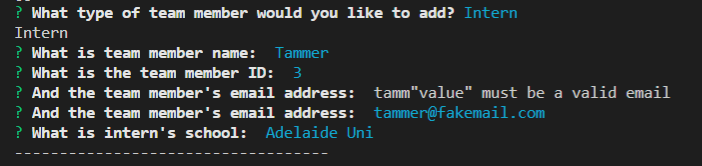
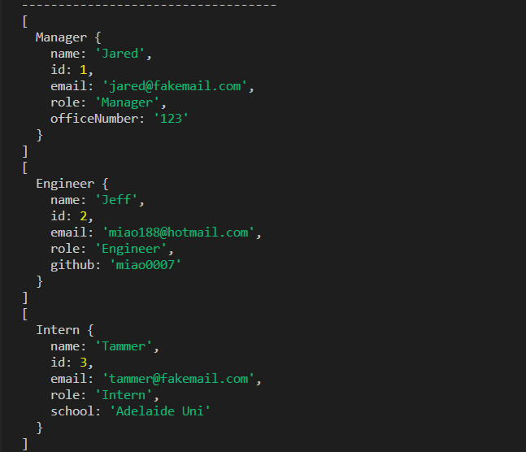
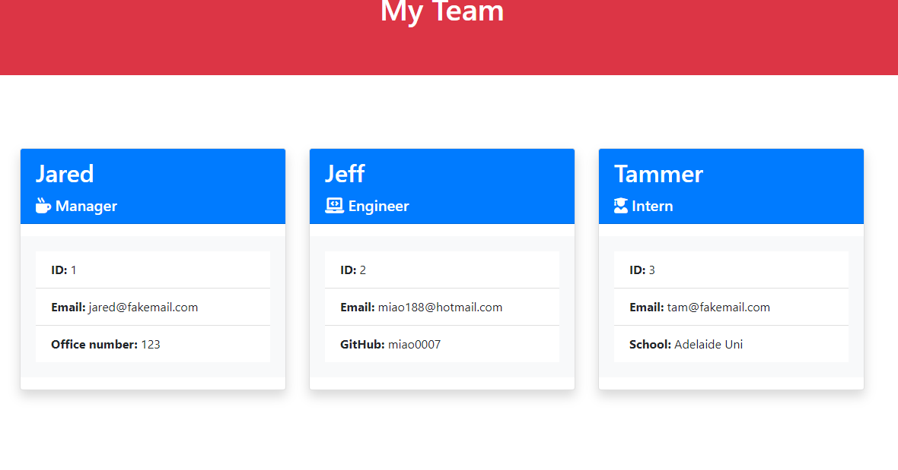

# team-template-engine


# Team Template Engine
## Description
The aim is to build a software engineering team generator command line application. The application will prompt the user for information about the team manager and then information about the team members. The user can input any number of team members, and they may be a mix of engineers and interns.
## Table of Contents
* [License](#license)
* [Installation](#installation)
* [Tests](#tests)
* [Usage](#usage)
* [Contributing](#contribution)
* [Questions](#questions)

## Installation
``` Install Node.js first, and then run npm install ```
## Tests
``` node app.js, npm run test ```
## Usage
As a manager
I want to generate a webpage that displays my team's basic info
so that I have quick access to emails and GitHub profiles
## License
ISC
## Contributing
Sole contributor by Jeff Miao
## Questions
GitHub: https://github.com/miao0007

Email: miao188@hotmail.com

## Deployed Video Link
https://drive.google.com/file/d/1lhG-Z7Vljebt4cZBZi50eNckJ-ADZPjc/view?usp=sharing

## Test Preview





